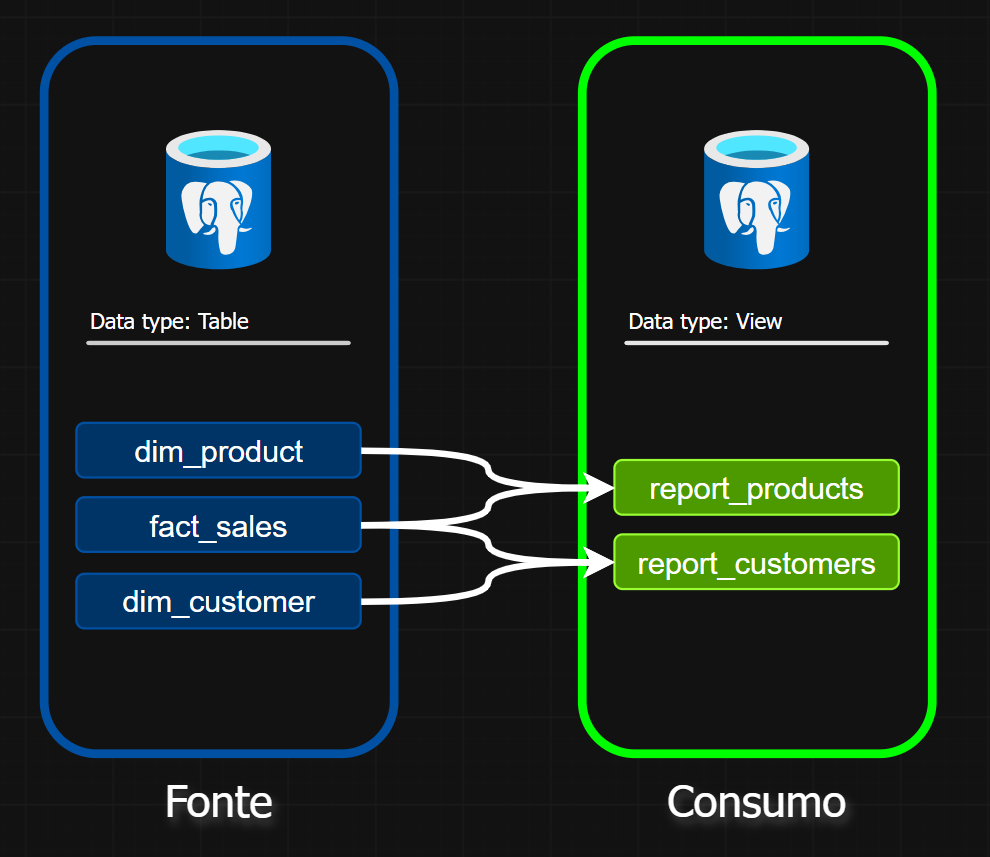
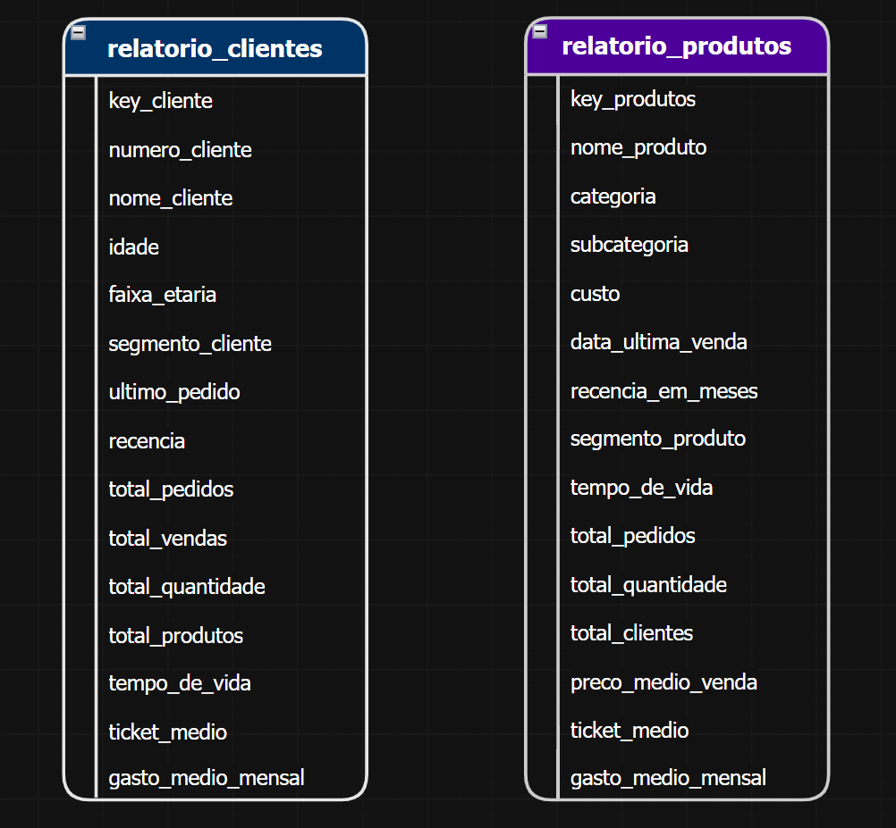

## Customer & Product Analytics

**Código:** [relatorio_clientes](https://github.com/angelo-vrsc/sql-consumer-product-analytics/blob/main/scripts/relatorio_clientes.sql), [relatorio_produtos](https://github.com/angelo-vrsc/sql-consumer-product-analytics/blob/main/scripts/relatorio_produtos.sql)

**Objetivo:** Desenvolver uma camada de consumo analítico sobre um Data 
Warehouse previamente construído, disponibilizando informações consolidadas
de clientes e produtos por meio de views SQL.

**Descrição:** O projeto utiliza como fonte o modelo dimensional da camada
Gold, composto pelas tabelas [fact_sales](https://github.com/angelo-vrsc/sql-consumer-product-analytics/blob/main/datasets/fact_sales.csv), [dim_customers](https://github.com/angelo-vrsc/sql-consumer-product-analytics/blob/main/datasets/dim_customers.csv) e [dim_products](https://github.com/angelo-vrsc/sql-consumer-product-analytics/blob/main/datasets/dim_products.csv).
A partir dessas tabelas, foram desenvolvidas as views [relatorio_clientes](https://github.com/angelo-vrsc/sql-consumer-product-analytics/blob/main/scripts/relatorio_clientes.sql)
e [relatorio_produtos](https://github.com/angelo-vrsc/sql-consumer-product-analytics/blob/main/scripts/relatorio_produtos.sql), aplicando agregações, métricas e regras de negócio
para facilitar o consumo dos dados.

**Habilidades:** SQL, PostgreSQL, Data Warehousing, Modelagem Dimensional,
Star Schema, CTEs, Agregações, Window Functions, Regras de Negócio, KPIs
e Data Analytics.

**Tecnologias:** PostgreSQL, SQL, Git e GitHub.

**Resultados:** Criação de duas views analíticas orientadas ao consumo, 
transformando as tabelas do modelo dimensional em conjuntos de dados
consolidados para análise de clientes e produtos. As views centralizam
métricas e regras de negócio, reduzindo a complexidade das consultas 
necessárias para análises e ferramentas de BI.

 

## Fluxo de dados

A camada de consumo utiliza como fonte o modelo dimensional da Gold
Layer, composto pelas tabelas fact_sales, dim_customers e
dim_products. A partir dessas tabelas foram desenvolvidas views
específicas para análise de clientes e produtos.

  

 

## Views de consumo

As views relatorio_clientes e relatorio_produtos consolidam
atributos, métricas e regras de negócio em estruturas orientadas ao
consumo analítico.

A relatorio_clientes concentra indicadores relacionados ao perfil e
ao comportamento de compra dos clientes, enquanto a
relatorio_produtos apresenta métricas relacionadas ao desempenho e
às vendas dos produtos.

  

 

## Principais regras de negócio

**Clientes**
- Classificação por faixa etária;
- Segmentação em VIP, Regular e Novo;
- Cálculo de recência e tempo de vida;
- Ticket médio e gasto médio mensal.

**Produtos**
- Segmentação por desempenho de vendas;
- Cálculo de recência e tempo de vida;
- Preço médio de venda;
- Ticket médio;
- Receita média mensal.

 

## Possibilidades de análise

A camada de consumo permite responder questões como:

- Quais clientes possuem maior valor de compra?
- Quais clientes estão há mais tempo sem realizar uma compra?
- Como os clientes estão distribuídos por faixa etária e segmento?
- Quais produtos apresentam maior volume de vendas?
- Quais produtos possuem maior receita?
- Quais categorias apresentam melhor desempenho?
- Quais produtos possuem maior receita média mensal?

